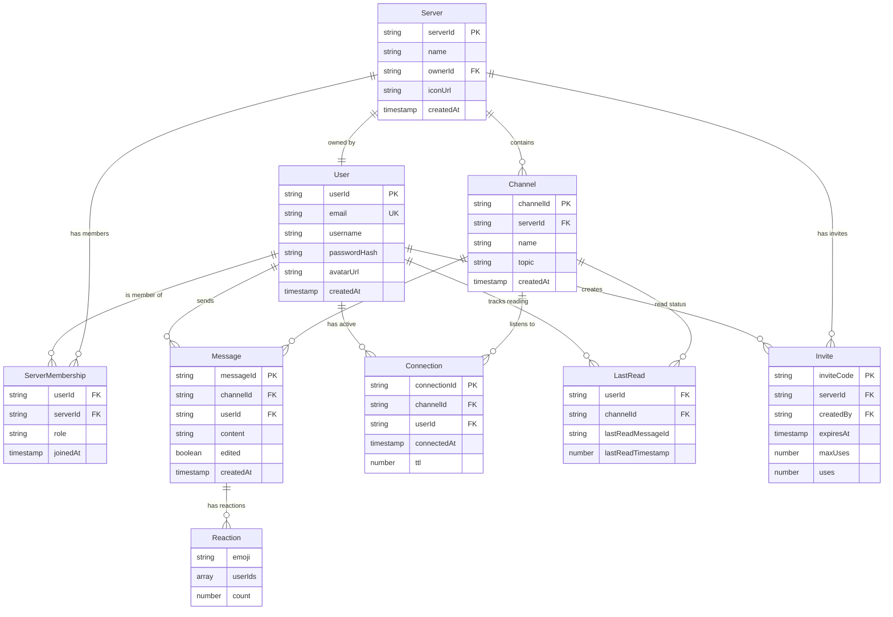

# DynamoDB Single-Table Design - Discord Clone

## Overview

This document defines the complete DynamoDB single-table schema for the Discord clone application. We use a single-table design pattern to optimize for access patterns and minimize costs.

**Design Principles:**

- Single table for all entities
- Prefixed partition keys for entity namespacing (`USER#`, `SERVER#`, etc.)
- One flexible Global Secondary Index (GSI1) for reverse lookups
- Composite sort keys with timestamps and ULIDs for uniqueness
- Denormalization where beneficial for query performance

---

## Table Configuration

**Table Name:** `discord-clone-{stage}-DiscordTable`

**Primary Index:**

- **Partition Key (PK):** `string` - Entity identifier
- **Sort Key (SK):** `string` - Entity type or relationship

**Global Secondary Index 1 (GSI1):**

- **Partition Key (gsi1pk):** `string` - Reverse lookup key
- **Sort Key (gsi1sk):** `string` - Secondary sort criteria
- **Projection:** ALL

**Stream:** Enabled (NEW_AND_OLD_IMAGES) - For WebSocket real-time updates

---

## Entity Definitions

### 1. User Entity

**Purpose:** Store user authentication and profile information

**Primary Access Pattern:** Get user by ID

**Item Structure:**

```json
{
  "pk": "USER#01JGSXXX...",
  "sk": "PROFILE",
  "gsi1pk": "EMAIL#user@example.com",
  "gsi1sk": "USER#01JGSXXX...",
  "entityType": "User",
  "userId": "01JGSXXX...",
  "email": "user@example.com",
  "username": "john_doe",
  "passwordHash": "$2a$10$...",
  "avatarUrl": "https://s3.../avatars/01JGSXXX.jpg",
  "createdAt": "2025-12-27T00:00:00.000Z",
  "updatedAt": "2025-12-27T00:00:00.000Z"
}
```

**Access Patterns:**

1. Get user by ID: `Query(PK = USER#{userId}, SK = PROFILE)`
2. Get user by email: `Query(GSI1, gsi1pk = EMAIL#{email})`

**Keys:**

- `pk`: `USER#{userId}` - ULID-based user ID
- `sk`: `PROFILE` - Fixed value for user profile
- `gsi1pk`: `EMAIL#{email}` - For login lookup
- `gsi1sk`: `USER#{userId}` - User ID for reverse lookup

---

### 2. Server Entity

**Purpose:** Store server (workspace/community) information

**Primary Access Pattern:** Get server by ID

**Item Structure:**

```json
{
  "pk": "SERVER#01JGSYYY...",
  "sk": "META",
  "gsi1pk": "SERVER#01JGSYYY...",
  "gsi1sk": "META",
  "entityType": "Server",
  "serverId": "01JGSYYY...",
  "name": "My Discord Server",
  "ownerId": "01JGSXXX...",
  "iconUrl": "https://s3.../server-icons/01JGSYYY.jpg",
  "createdAt": "2025-12-27T00:00:00.000Z",
  "updatedAt": "2025-12-27T00:00:00.000Z"
}
```

**Access Patterns:**

1. Get server by ID: `Query(PK = SERVER#{serverId}, SK = META)`
2. Get all servers (admin): `Query(GSI1, gsi1pk begins_with SERVER#)`

**Keys:**

- `pk`: `SERVER#{serverId}` - ULID-based server ID
- `sk`: `META` - Fixed value for server metadata
- `gsi1pk`: `SERVER#{serverId}` - For reverse queries
- `gsi1sk`: `META` - Server metadata indicator

---

### 3. Server Membership Entity

**Purpose:** Track user-to-server relationships

**Primary Access Pattern:** Get user's servers, get server's members

**Item Structure:**

```json
{
  "pk": "USER#01JGSXXX...",
  "sk": "SERVER#01JGSYYY...",
  "gsi1pk": "SERVER#01JGSYYY...",
  "gsi1sk": "USER#01JGSXXX...",
  "entityType": "ServerMembership",
  "userId": "01JGSXXX...",
  "serverId": "01JGSYYY...",
  "role": "member",
  "joinedAt": "2025-12-27T00:00:00.000Z"
}
```

**Access Patterns:**

1. Get user's servers: `Query(PK = USER#{userId}, SK begins_with SERVER#)`
2. Get server's members: `Query(GSI1, gsi1pk = SERVER#{serverId}, gsi1sk begins_with USER#)`
3. Check if user is in server: `GetItem(PK = USER#{userId}, SK = SERVER#{serverId})`

**Keys:**

- `pk`: `USER#{userId}` - User who joined
- `sk`: `SERVER#{serverId}` - Server they joined
- `gsi1pk`: `SERVER#{serverId}` - For reverse lookup (members of server)
- `gsi1sk`: `USER#{userId}` - User who is a member

---

### 4. Channel Entity

**Purpose:** Store text channels within servers

**Primary Access Pattern:** Get channel by ID, get server's channels

**Item Structure:**

```json
{
  "pk": "SERVER#01JGSYYY...",
  "sk": "CHANNEL#01JGSZSZ...",
  "gsi1pk": "CHANNEL#01JGSZSZ...",
  "gsi1sk": "META",
  "entityType": "Channel",
  "channelId": "01JGSZSZ...",
  "serverId": "01JGSYYY...",
  "name": "general",
  "topic": "General discussion",
  "createdAt": "2025-12-27T00:00:00.000Z",
  "updatedAt": "2025-12-27T00:00:00.000Z"
}
```

**Access Patterns:**

1. Get server's channels: `Query(PK = SERVER#{serverId}, SK begins_with CHANNEL#)`
2. Get channel by ID: `Query(GSI1, gsi1pk = CHANNEL#{channelId})`

**Keys:**

- `pk`: `SERVER#{serverId}` - Parent server
- `sk`: `CHANNEL#{channelId}` - ULID-based channel ID
- `gsi1pk`: `CHANNEL#{channelId}` - For direct channel lookup
- `gsi1sk`: `META` - Channel metadata indicator

---

### 5. Message Entity

**Purpose:** Store chat messages in channels

**Primary Access Pattern:** Get messages in a channel (paginated, newest first)

**Item Structure:**

```json
{
  "pk": "CHANNEL#01JGSZSZ...",
  "sk": "MSG#1735257600000#01JGSTTT...",
  "gsi1pk": "MSG#01JGSTTT...",
  "gsi1sk": "CHANNEL#01JGSZSZ...",
  "entityType": "Message",
  "messageId": "01JGSTTT...",
  "channelId": "01JGSZSZ...",
  "userId": "01JGSXXX...",
  "username": "john_doe",
  "content": "Hello, world!",
  "edited": false,
  "editedAt": null,
  "reactions": [],
  "createdAt": "2025-12-27T00:00:00.000Z",
  "updatedAt": "2025-12-27T00:00:00.000Z"
}
```

**Access Patterns:**

1. Get messages in channel (paginated): `Query(PK = CHANNEL#{channelId}, SK begins_with MSG#, ScanIndexForward = false)`
2. Get messages after timestamp: `Query(PK = CHANNEL#{channelId}, SK > MSG#{timestamp}#)`
3. Get message by ID: `Query(GSI1, gsi1pk = MSG#{messageId})`
4. Update/delete message: Use message ID to query GSI1, then update primary key

**Keys:**

- `pk`: `CHANNEL#{channelId}` - Channel containing the message
- `sk`: `MSG#{timestamp}#{messageId}` - Composite key for time-based sorting and uniqueness
- `gsi1pk`: `MSG#{messageId}` - For direct message lookup (edit/delete)
- `gsi1sk`: `CHANNEL#{channelId}` - Reverse relationship

**Sort Key Format:**

- `timestamp`: Unix milliseconds (e.g., `1735257600000`)
- `messageId`: ULID (e.g., `01JGSTTT...`)
- Example: `MSG#1735257600000#01JGSTTT123ABC`

**Reactions Array Structure:**

```json
"reactions": [
  {
    "emoji": "👍",
    "userIds": ["01JGSXXX...", "01JGSYYY..."],
    "count": 2
  }
]
```

---

### 6. Invite Entity

**Purpose:** Store server invite links

**Primary Access Pattern:** Get invite by code, get server's invites

**Item Structure:**

```json
{
  "pk": "SERVER#01JGSYYY...",
  "sk": "INVITE#abc123xyz",
  "gsi1pk": "INVITE#abc123xyz",
  "gsi1sk": "SERVER#01JGSYYY...",
  "entityType": "Invite",
  "inviteCode": "abc123xyz",
  "serverId": "01JGSYYY...",
  "createdBy": "01JGSXXX...",
  "expiresAt": null,
  "maxUses": null,
  "uses": 0,
  "createdAt": "2025-12-27T00:00:00.000Z"
}
```

**Access Patterns:**

1. Get invite by code: `Query(GSI1, gsi1pk = INVITE#{code})`
2. Get server's invites: `Query(PK = SERVER#{serverId}, SK begins_with INVITE#)`
3. Increment invite uses: `Update(PK, SK, SET uses = uses + 1)`

**Keys:**

- `pk`: `SERVER#{serverId}` - Server this invite is for
- `sk`: `INVITE#{inviteCode}` - Random alphanumeric code (8-12 chars)
- `gsi1pk`: `INVITE#{inviteCode}` - For invite lookup when joining
- `gsi1sk`: `SERVER#{serverId}` - Reverse relationship

---

### 7. WebSocket Connection Entity

**Purpose:** Track active WebSocket connections for presence and real-time messaging

**Primary Access Pattern:** Get connections in a channel, cleanup on disconnect

**Item Structure:**

```json
{
  "pk": "CHANNEL#01JGSZSZ...",
  "sk": "CONN#xyz789conn",
  "gsi1pk": "CONN#xyz789conn",
  "gsi1sk": "USER#01JGSXXX...",
  "entityType": "Connection",
  "connectionId": "xyz789conn",
  "channelId": "01JGSZSZ...",
  "serverId": "01JGSYYY...",
  "userId": "01JGSXXX...",
  "connectedAt": "2025-12-27T00:00:00.000Z",
  "ttl": 1735344000
}
```

**Access Patterns:**

1. Get all connections in channel: `Query(PK = CHANNEL#{channelId}, SK begins_with CONN#)`
2. Get connection by ID: `Query(GSI1, gsi1pk = CONN#{connectionId})`
3. Get user's connections: `Query(GSI1, gsi1pk = USER#{userId})`
4. Cleanup on disconnect: `DeleteItem(PK, SK)` using connection ID from GSI1 query

**Keys:**

- `pk`: `CHANNEL#{channelId}` - Channel the connection is listening to
- `sk`: `CONN#{connectionId}` - WebSocket connection ID from API Gateway
- `gsi1pk`: `CONN#{connectionId}` - For disconnect lookup
- `gsi1sk`: `USER#{userId}` - User who owns this connection

**TTL:**

- `ttl`: Unix timestamp for automatic cleanup (24 hours after connection)
- DynamoDB TTL will auto-delete stale connections

---

### 8. User Last Read Entity

**Purpose:** Track last read message per user per channel (for unread indicators)

**Primary Access Pattern:** Get user's last read position in a channel

**Item Structure:**

```json
{
  "pk": "USER#01JGSXXX...",
  "sk": "LASTREAD#CHANNEL#01JGSZSZ...",
  "gsi1pk": "CHANNEL#01JGSZSZ...",
  "gsi1sk": "USER#01JGSXXX...",
  "entityType": "LastRead",
  "userId": "01JGSXXX...",
  "channelId": "01JGSZSZ...",
  "lastReadMessageId": "01JGSTTT...",
  "lastReadTimestamp": 1735257600000,
  "updatedAt": "2025-12-27T00:00:00.000Z"
}
```

**Access Patterns:**

1. Get user's last read for a channel: `GetItem(PK = USER#{userId}, SK = LASTREAD#CHANNEL#{channelId})`
2. Get all users' read status for a channel: `Query(GSI1, gsi1pk = CHANNEL#{channelId}, gsi1sk begins_with USER#)`
3. Update last read: `PutItem` or `UpdateItem`

**Keys:**

- `pk`: `USER#{userId}` - User tracking their read position
- `sk`: `LASTREAD#CHANNEL#{channelId}` - Channel being tracked
- `gsi1pk`: `CHANNEL#{channelId}` - For reverse lookup (all readers of channel)
- `gsi1sk`: `USER#{userId}` - User who read

---

## Access Pattern Summary

| #   | Access Pattern                      | Index   | Key Condition                                              |
| --- | ----------------------------------- | ------- | ---------------------------------------------------------- |
| 1   | Get user by ID                      | Primary | `PK = USER#{userId} AND SK = PROFILE`                      |
| 2   | Get user by email (login)           | GSI1    | `gsi1pk = EMAIL#{email}`                                   |
| 3   | Get server by ID                    | Primary | `PK = SERVER#{serverId} AND SK = META`                     |
| 4   | Get user's servers                  | Primary | `PK = USER#{userId} AND SK begins_with SERVER#`            |
| 5   | Get server's members                | GSI1    | `gsi1pk = SERVER#{serverId} AND gsi1sk begins_with USER#`  |
| 6   | Get server's channels               | Primary | `PK = SERVER#{serverId} AND SK begins_with CHANNEL#`       |
| 7   | Get channel by ID                   | GSI1    | `gsi1pk = CHANNEL#{channelId}`                             |
| 8   | Get messages in channel (paginated) | Primary | `PK = CHANNEL#{channelId} AND SK begins_with MSG#`         |
| 9   | Get messages after timestamp        | Primary | `PK = CHANNEL#{channelId} AND SK > MSG#{timestamp}#`       |
| 10  | Get message by ID (edit/delete)     | GSI1    | `gsi1pk = MSG#{messageId}`                                 |
| 11  | Get invite by code                  | GSI1    | `gsi1pk = INVITE#{code}`                                   |
| 12  | Get server's invites                | Primary | `PK = SERVER#{serverId} AND SK begins_with INVITE#`        |
| 13  | Get connections in channel          | Primary | `PK = CHANNEL#{channelId} AND SK begins_with CONN#`        |
| 14  | Get connection by ID (disconnect)   | GSI1    | `gsi1pk = CONN#{connectionId}`                             |
| 15  | Get user's last read for channel    | Primary | `PK = USER#{userId} AND SK = LASTREAD#CHANNEL#{channelId}` |
| 16  | Check server membership             | Primary | `GetItem(PK = USER#{userId}, SK = SERVER#{serverId})`      |

---

## Entity Relationship Diagram



---

## Key Design Decisions

### 1. Single Table vs Multi-Table

**Decision:** Single table
**Rationale:**

- Optimizes for access patterns (most queries need related data)
- Reduces costs (fewer tables, fewer indexes)
- Enables atomic transactions across entity types
- Industry best practice for DynamoDB

### 2. Message Sort Key Format

**Decision:** `MSG#{timestamp}#{ulid}`
**Rationale:**

- Timestamp enables efficient time-based queries
- ULID ensures uniqueness (prevents collisions)
- Sortable for pagination
- Readable in DynamoDB console for debugging

### 3. Single GSI vs Multiple GSIs

**Decision:** Single flexible GSI (GSI1)
**Rationale:**

- Reduces costs (each GSI has separate read/write capacity)
- Flexible key structure handles all reverse lookups
- Easier to manage and understand
- Can add more GSIs later if needed

### 4. Denormalization Strategy

**Decision:** Denormalize username in messages
**Rationale:**

- Avoids additional query to get username for each message
- Username rarely changes (can update messages on username change if needed)
- Significantly improves message list query performance

### 5. Soft Delete vs Hard Delete

**Decision:** Hard delete for messages (for now)
**Rationale:**

- Simpler implementation
- Reduces storage costs
- Can implement soft delete later if audit trail needed
- Discord-like UX shows "[message deleted]" placeholder but doesn't preserve content

---

## ID Generation Strategy

**All entity IDs use ULID (Universally Unique Lexicographically Sortable Identifier):**

**Why ULID over UUID?**

- ✅ Lexicographically sortable (time-ordered)
- ✅ More compact (26 characters vs 36 for UUID)
- ✅ Case-insensitive, URL-safe
- ✅ Timestamp embedded (first 10 characters)
- ✅ Cryptographically strong randomness

**Library:** `ulid` npm package (already in dependencies)

**Example:**

```typescript
import { ulid } from 'ulid'

const userId = ulid() // "01JGSXXX123ABC..."
```

---

## Migration Strategy

**Phase 1: Initial Schema (Current)**

- All entities defined above
- One GSI for reverse lookups

**Future Migrations:**

- Add new attributes: Use `UpdateItem`, default values for old items
- Add new entity types: Just add items with new PK/SK patterns
- Add new GSI: Create GSI, backfill with scan + write
- Change PK/SK structure: Create migration script, dual-write during transition

**Versioning:**

- Add `schemaVersion` attribute to items if major migrations needed
- Application code can handle multiple versions during migration

---

## Cost Optimization

**Read/Write Capacity Strategy:**

- **Dev/Test:** On-demand pricing (pay per request)
- **Production:** Provisioned capacity with auto-scaling
- **Estimated costs (dev):** ~$0.25/month (under free tier)

**Index Optimization:**

- Only one GSI (reduces costs)
- Project ALL (acceptable for small items)
- Consider KEYS_ONLY projection if items grow large

**TTL for Cleanup:**

- WebSocket connections auto-expire after 24 hours
- Reduces manual cleanup queries
- No cost for TTL deletions

---

## Performance Considerations

**Hot Keys:**

- Popular channels may have hot partition (many messages)
- Mitigation: DynamoDB adaptive capacity handles this automatically
- Monitor CloudWatch metrics for throttling

**Query Pagination:**

- Messages queries return max 1MB or 100 items
- Use `LastEvaluatedKey` for pagination
- Frontend implements infinite scroll

**Batch Operations:**

- `BatchGetItem` for loading multiple servers/channels
- `BatchWriteItem` for bulk operations (max 25 items)

**Eventual Consistency:**

- GSI queries are eventually consistent
- Acceptable for our use case (slight delay in reverse lookups)
- Can use strongly consistent reads on primary index if needed

---

## Security Considerations

**Row-Level Security:**

- Application enforces access control (not DB-level)
- Verify user is member of server before returning channels/messages
- Use tRPC context middleware for authorization

**Sensitive Data:**

- Password hashes only (never plaintext)
- Consider encryption at rest (AWS KMS) for compliance
- Audit logging for sensitive operations

**Rate Limiting:**

- Application-level rate limiting (not DynamoDB)
- Prevent abuse of invite codes, message spam
- Use API Gateway throttling

---

## Example Queries

### Get User's Servers with Channel Counts

```typescript
// 1. Query user's server memberships
const memberships = await dynamoDb.query({
  TableName: 'DiscordTable',
  KeyConditionExpression: 'pk = :pk AND begins_with(sk, :sk)',
  ExpressionAttributeValues: {
    ':pk': 'USER#01JGSXXX...',
    ':sk': 'SERVER#',
  },
})

// 2. For each server, get channel count
const serverIds = memberships.Items.map((m) => m.serverId)
const channelCounts = await Promise.all(
  serverIds.map((serverId) =>
    dynamoDb.query({
      TableName: 'DiscordTable',
      KeyConditionExpression: 'pk = :pk AND begins_with(sk, :sk)',
      ExpressionAttributeValues: {
        ':pk': `SERVER#${serverId}`,
        ':sk': 'CHANNEL#',
      },
      Select: 'COUNT',
    })
  )
)
```

### Get Messages with Pagination (Newest First)

```typescript
const messages = await dynamoDb.query({
  TableName: 'DiscordTable',
  KeyConditionExpression: 'pk = :pk AND begins_with(sk, :sk)',
  ExpressionAttributeValues: {
    ':pk': 'CHANNEL#01JGSZSZ...',
    ':sk': 'MSG#',
  },
  ScanIndexForward: false, // Descending order (newest first)
  Limit: 50,
  ExclusiveStartKey: lastEvaluatedKey, // For pagination
})
```

### Check if User Can Access Channel

```typescript
// 1. Get channel to find server ID
const channel = await dynamoDb.query({
  IndexName: 'gsi1',
  TableName: 'DiscordTable',
  KeyConditionExpression: 'gsi1pk = :pk',
  ExpressionAttributeValues: {
    ':pk': 'CHANNEL#01JGSZSZ...',
  },
})

// 2. Check if user is member of that server
const membership = await dynamoDb.get({
  TableName: 'DiscordTable',
  Key: {
    pk: 'USER#01JGSXXX...',
    sk: `SERVER#${channel.Items[0].serverId}`,
  },
})

const hasAccess = !!membership.Item
```

---

## Testing Data Examples

### Sample Items for Testing

```json
// User
{
  "pk": "USER#01JGSTEST001",
  "sk": "PROFILE",
  "gsi1pk": "EMAIL#test@example.com",
  "gsi1sk": "USER#01JGSTEST001",
  "entityType": "User",
  "userId": "01JGSTEST001",
  "email": "test@example.com",
  "username": "testuser",
  "passwordHash": "$2a$10$HASHEDPASSWORD",
  "avatarUrl": null,
  "createdAt": "2025-12-27T00:00:00.000Z",
  "updatedAt": "2025-12-27T00:00:00.000Z"
}

// Server
{
  "pk": "SERVER#01JGSTEST002",
  "sk": "META",
  "gsi1pk": "SERVER#01JGSTEST002",
  "gsi1sk": "META",
  "entityType": "Server",
  "serverId": "01JGSTEST002",
  "name": "Test Server",
  "ownerId": "01JGSTEST001",
  "iconUrl": null,
  "createdAt": "2025-12-27T00:00:00.000Z",
  "updatedAt": "2025-12-27T00:00:00.000Z"
}

// Membership
{
  "pk": "USER#01JGSTEST001",
  "sk": "SERVER#01JGSTEST002",
  "gsi1pk": "SERVER#01JGSTEST002",
  "gsi1sk": "USER#01JGSTEST001",
  "entityType": "ServerMembership",
  "userId": "01JGSTEST001",
  "serverId": "01JGSTEST002",
  "role": "owner",
  "joinedAt": "2025-12-27T00:00:00.000Z"
}

// Channel
{
  "pk": "SERVER#01JGSTEST002",
  "sk": "CHANNEL#01JGSTEST003",
  "gsi1pk": "CHANNEL#01JGSTEST003",
  "gsi1sk": "META",
  "entityType": "Channel",
  "channelId": "01JGSTEST003",
  "serverId": "01JGSTEST002",
  "name": "general",
  "topic": "General chat",
  "createdAt": "2025-12-27T00:00:00.000Z",
  "updatedAt": "2025-12-27T00:00:00.000Z"
}

// Message
{
  "pk": "CHANNEL#01JGSTEST003",
  "sk": "MSG#1735257600000#01JGSTEST004",
  "gsi1pk": "MSG#01JGSTEST004",
  "gsi1sk": "CHANNEL#01JGSTEST003",
  "entityType": "Message",
  "messageId": "01JGSTEST004",
  "channelId": "01JGSTEST003",
  "userId": "01JGSTEST001",
  "username": "testuser",
  "content": "Hello, world!",
  "edited": false,
  "editedAt": null,
  "reactions": [],
  "createdAt": "2025-12-27T00:00:00.000Z",
  "updatedAt": "2025-12-27T00:00:00.000Z"
}
```

---

## Next Steps

1. **Implement Database Utilities** (`packages/core/src/db/`)
   - DynamoDB client setup
   - Entity key builders
   - CRUD operation helpers

2. **Create TypeScript Types** (`packages/core/src/types/`)
   - Type definitions for all entities
   - Input/output types for operations

3. **Write Unit Tests** (`packages/core/src/db/__tests__/`)
   - Test key generation functions
   - Test CRUD operations with mocked DynamoDB

4. **Update SST Config** (if needed)
   - Verify GSI configuration matches this schema
   - Add DynamoDB stream configuration for WebSocket

5. **Build Phase 1: Auth System**
   - User registration (create User entity)
   - Login (query by email via GSI1)
   - JWT token generation
   - Auth middleware for tRPC

---

**Last Updated:** 2025-12-27  
**Schema Version:** 1.0.0  
**Status:** ✅ Ready for Implementation
